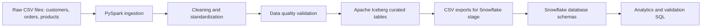

# Project 1 Documentation - Retail Data Engineering Pipeline

## 1. Executive Summary

This project implements a basic modern data engineering pipeline for a retail company. The source data comes from three CSV files: customers, orders, and products. The files contain realistic data quality issues such as duplicate rows, invalid IDs, invalid dates, negative values, mixed boolean formats, bad emails, bad phone numbers, and currency symbols mixed with numeric fields.

The solution uses PySpark to ingest, clean, validate, enrich, and aggregate the data. Curated datasets are written to Apache Iceberg tables and exported as CSV files that can be loaded into Snowflake for reporting and analysis.

## 2. Business Scenario

A retail company receives daily transaction files. Before business users can report on customer orders and product sales, the data must be standardized and validated. The final warehouse should support questions such as:

- Which product categories generate the most revenue?
- Who are the top customers?
- Which products sell the most units?
- How much revenue comes from each order status and payment method?
- How many rows were rejected during data quality checks?

## 3. Architecture

## 4. Data Sources

| File | Description | Main Fields |
|---|---|---|
| `customers.csv` | Customer profile records | customer_id, name, email, phone, signup_date, country, state, is_active, loyalty_points |
| `orders.csv` | Customer order transactions | order_id, customer_id, product_id, order_date, ship_date, quantity, unit_price, discount_pct, total_amount, payment_method, order_status |
| `products.csv` | Product master data | product_id, product_name, category, brand, price, cost, stock_quantity, weight_kg, created_date, is_active |

## 5. Data Quality Rules

### Customer Rules

- Customer ID must be numeric.
- Email must match a valid email pattern.
- Sign-up date must be parseable.
- Boolean fields are standardized from values such as TRUE, false, Yes, No, Y, N, 1, and 0.
- Country and state fields are standardized.
- Negative loyalty points are set to 0.
- Very large loyalty point values are treated as impossible and set to null.
- Duplicate customer records are removed by customer ID.

### Product Rules

- Product ID must follow the `P####` pattern.
- Price must be positive.
- Cost must be zero or positive.
- Stock quantity must be zero or positive.
- Weight must be positive.
- Created date must be parseable.
- Gross margin and gross margin percentage are calculated.
- Duplicate product records are removed by product ID.

### Order Rules

- Order ID and customer ID must be numeric.
- Product ID must follow the `P####` pattern.
- Order date must be parseable.
- Ship date must be null or greater than/equal to order date.
- Quantity must be positive.
- Unit price must be positive.
- Discount percentage must be between 0 and 100.
- Total amount must be positive, or it is recalculated from quantity, unit price, and discount.
- Customer and product foreign keys must exist in the curated customer and product dimensions.
- Duplicate orders are removed by order ID.

## 6. Transformations

The pipeline creates the following curated datasets:

| Dataset | Type | Description |
|---|---|---|
| `dim_customers` | Dimension | Clean customer records |
| `dim_products` | Dimension | Clean product records with calculated margin fields |
| `fact_orders` | Fact | Validated order transactions |
| `mart_customer_sales` | Mart | Revenue and quantity summarized by customer |
| `mart_product_sales` | Mart | Revenue, quantity, and profit summarized by product |
| `mart_category_sales` | Mart | Revenue, quantity, and profit summarized by category |
| `dq_summary` | Validation | Raw, curated, and rejected counts |

## 7. Iceberg Design

Apache Iceberg is used as the open table format for the curated layer. The project supports two catalog modes:

| Mode | Catalog | Use Case |
|---|---|---|
| `local` | Hadoop catalog | Local testing in VS Code or Jupyter |
| `emr` | AWS Glue catalog with S3 file IO | EMR production-style cloud run |

The original starter file used an AWS Glue catalog and S3 warehouse. The completed version keeps that idea but makes it configurable so the same logic can run locally or on EMR.

## 8. Snowflake Design

The Snowflake scripts create four schemas:

| Schema | Purpose |
|---|---|
| `RAW` | File format and staging objects |
| `CURATED` | Clean dimension and fact tables |
| `MARTS` | Aggregated reporting tables |
| `DQ` | Data quality result tables |

Snowflake loads the PySpark CSV exports through a stage using `COPY INTO` and column-name matching.

## 9. Analytical Queries

The project includes analytical queries for:

1. Total revenue and profit by category.
2. Top customers by revenue.
3. Top products by quantity sold.
4. Revenue by order status and payment method.
5. Monthly sales trend.
6. Average delivery days by status.

## 10. Validation Summary from Provided Files

| Dataset | Raw Count | Curated Count | Rejected Count |
|---|---:|---:|---:|
| customers | 22 | 15 | 7 |
| products | 22 | 16 | 6 |
| orders | 24 | 8 | 16 |

The high rejected order count is expected because the sample order file intentionally includes bad customer IDs, bad product IDs, invalid dates, negative prices, invalid discounts, zero or negative quantities, and invalid foreign keys.

## 11. Key Implementation Decisions

- Raw data is read as strings first to avoid losing dirty values during ingestion.
- Cleaning is handled in PySpark, not manually in the source files.
- Invalid rows are rejected instead of silently forcing bad records into curated tables.
- Business marts are generated in PySpark and also queryable in Snowflake.
- Data quality summary tables make validation simple and presentable.
